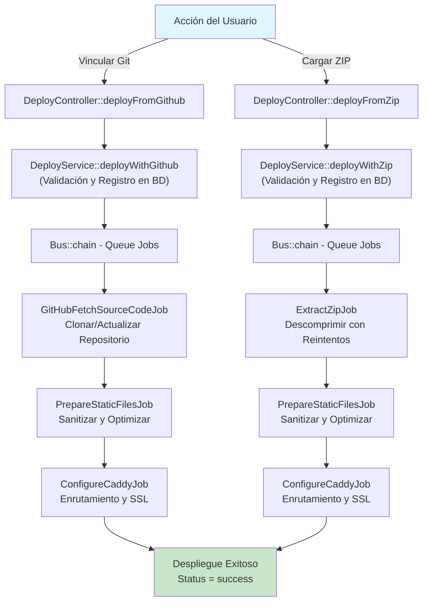
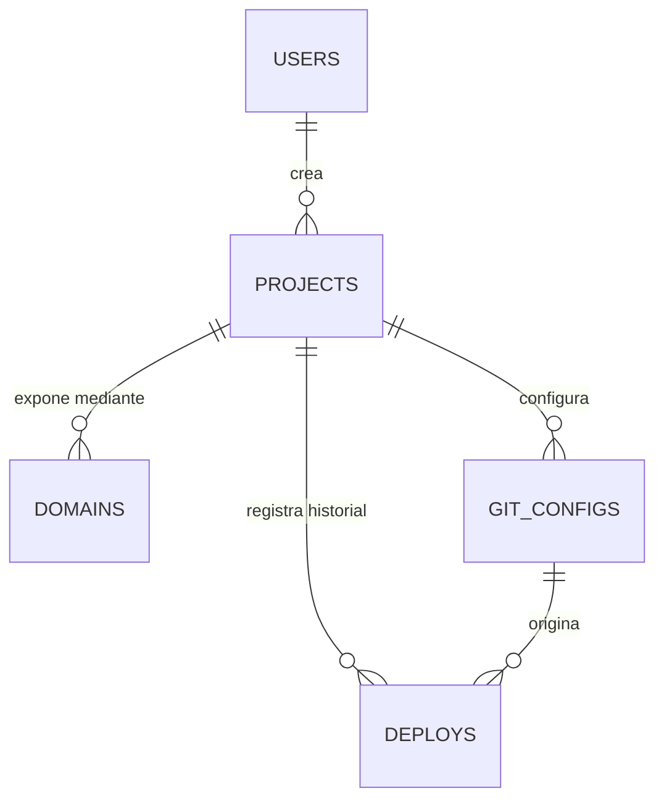

# SkyManifest ☁️

> **Tu nube privada, manifestada.**

Una plataforma de despliegue de sitios estáticos autohospedada que democratiza la infraestructura de nube privada. Despliega aplicaciones directamente desde archivos ZIP o repositorios Git con configuración automática de servidores, gestión de SSL y despliegues sin tiempo de inactividad.

---

## ⚠️ Nota Importante

**SkyManifest es un prototipo en desarrollo.** Aunque la filosofía del proyecto busca la independencia de servicios de nube de terceros, su objetivo principal es **facilitar y agilizar el despliegue de sitios web estáticos**, eliminando fricción en el proceso de publicación y ofreciendo una alternativa accesible a plataformas comerciales.

## Tabla de Contenidos

1. [Visión General del Proyecto](#visión-general-del-proyecto)
2. [Explicación del Nombre](#explicación-del-nombre)
3. [Arquitectura Principal](#arquitectura-principal)
4. [Patrones de Diseño del Sistema](#patrones-de-diseño-del-sistema)
5. [Esquema de Base de Datos](#esquema-de-base-de-datos)
6. [Endpoints de la API](#endpoints-de-la-api)
7. [Proceso de Despliegue](#proceso-de-despliegue)

---

## Visión General del Proyecto

**SkyManifest** es una plataforma de infraestructura autohospedada que elimina la dependencia de servicios de terceros como Vercel o Netlify. Los usuarios pueden:

- Desplegar sitios estáticos mediante carga de archivos ZIP
- Vincular repositorios Git para despliegues automáticos
- Gestionar múltiples proyectos y dominios
- Controlar certificados SSL y configuración del servidor web
- Monitorear historial de despliegues y registros

El sistema opera en un **modelo de despliegue híbrido** compatible con cargas de archivos directas y despliegues basados en repositorios, con sanitización, optimización y configuración de enrutamiento automáticas.

## Explicación del Nombre

**SkyManifest** encapsula la filosofía central:

- **Sky (Cielo/Nube):** Representa infraestructura privada ilimitada bajo control total del usuario. Tu propio ecosistema digital independiente sin dependencia de terceros.
- **Manifest (Manifiesto):** Cada despliegue crea un manifiesto inmutable—un registro detallado que documenta estado, configuración y existencia de la aplicación dentro de la infraestructura.

---

## Arquitectura Principal

### 1. Visión General de Arquitectura en Capas

SkyManifest implementa una **arquitectura en capas** limpia con separación clara de responsabilidades:

```
┌─────────────────────────────────────┐
│   Capa HTTP (Controladores)         │  Validación de entrada, manejo de respuestas
├─────────────────────────────────────┤
│   Capa de Aplicación (Servicios)    │  Lógica de negocio, orquestación
├─────────────────────────────────────┤
│   Capa de Datos (Repositorios)      │  Consultas a BD, persistencia de datos
├─────────────────────────────────────┤
│   Capa de Cola (Jobs)               │  Procesamiento asincrónico, tareas pesadas
├─────────────────────────────────────┤
│   Capa de Dominio (Modelos)         │  Definición de entidades, relaciones
└─────────────────────────────────────┘
```

### 2. Estructura de Directorios y Responsabilidades

#### **📂 `app/Http/Controllers/Api/`**
Puntos de entrada de la API - controladores delgados que validan solicitudes y delegan en servicios.

| Controlador | Responsabilidad |
|---|---|
| `AuthController` | Registro de usuarios, login, renovación de tokens, gestión de perfil |
| `ProjectController` | Operaciones CRUD de proyectos |
| `DeployController` | Recuperación de historial de despliegues, gatillos de despliegue (Git/ZIP) |
| `DomainController` | Gestión de dominios para proyectos |
| `GitConfigController` | Almacenamiento y actualizaciones de configuración Git |

**Principio Clave:** Los controladores nunca contienen lógica de negocio. Aceptan solicitudes validadas y devuelven respuestas JSON estandarizadas.

#### **📂 `app/Services/`**
El motor de lógica de negocio de la aplicación. Cada servicio maneja un dominio específico.

| Servicio | Responsabilidad |
|---|---|
| `AuthService` | Autenticación de usuarios, generación de tokens, gestión de sesiones |
| `ProjectService` | Ciclo de vida de proyectos (crear, leer, actualizar, eliminar) |
| `DeployService` | **Orquestación central** - gestiona flujos de despliegue Git y ZIP |
| `DomainService` | Verificación de disponibilidad de dominios, activación/desactivación |
| `GitConfigService` | Persistencia y recuperación de configuración Git |
| `GitHubServices` | Operaciones Git (clone, fetch, update con cambio de rama) |
| `CaddyService` | Abstracción de API del servidor web para enrutamiento y SSL de dominios |

**DeployService - Análisis Detallado:**
- `deployWithGithub()` - Inicia cadena de despliegue basada en GitHub
- `deployWithZip()` - Inicia cadena de despliegue basada en ZIP
- `updateDeployStatus()` - Rastrea progreso de despliegue
- `getHistoryByProject()` - Recupera registros de despliegue
- `getLatestSuccessful()` - Obtiene versión de producción activa

#### **📂 `app/Repositories/`**
Capa de acceso a datos - aísla consultas Eloquent de la lógica de negocio.

| Repositorio | Propósito |
|---|---|
| `AuthRepository` | Consultas del modelo User, gestión de tokens |
| `ProjectRepo` | Consultas de proyectos con filtrado |
| `DeployRepo` | Recuperación de registros de despliegue, consultas de estado |
| `DomainRepo` | Búsquedas de dominios, filtrado de dominios activos |
| `GitConfigRepo` | Recuperación de configuración Git |

**Patrón:** Los repositorios reciben solicitudes simples ("Obtén dominios activos para el proyecto X") y devuelven objetos de dominio sin exponer detalles SQL.

#### **📂 `app/Jobs/` (Sistema de Cola)**
Tareas asincrónicas en segundo plano procesadas mediante el sistema de colas de Laravel. Evita bloquear el ciclo de solicitud principal durante operaciones pesadas.

| Job | Se Ejecuta | Propósito |
|---|---|---|
| `GitHubFetchSourceCodeJob` | 1º en cadena | Clona/actualiza repositorio desde GitHub con selección de rama |
| `ExtractZipJob` | 1º (ZIP) o 2º (Git) | Extrae contenidos ZIP con lógica de reintentos para sincronización Docker |
| `PrepareStaticFilesJob` | 2º (ZIP) o 3º (Git) | Sanitiza, optimiza, elimina archivos no estáticos, maneja directorios de compilación |
| `ConfigureCaddyJob` | 3º (ZIP) o 4º (Git) | Configura dominios del servidor web, certificados SSL vía API de Caddy |

**Encadenamiento de Jobs:** Los jobs se ejecutan secuencialmente usando `Bus::chain()` de Laravel:
```
Despliegue GitHub:   GitHubFetchSourceCodeJob → PrepareStaticFilesJob → ConfigureCaddyJob
Despliegue ZIP:      ExtractZipJob → PrepareStaticFilesJob → ConfigureCaddyJob
```

Cada job actualiza el registro de Deploy con mensajes de log y estado. Si algún job falla, la cadena se detiene y el despliegue se marca como fallido.

#### **📂 `app/Models/`**
Modelos Eloquent que definen entidades y relaciones.

| Modelo | Representa |
|---|---|
| `User` | Usuarios de la plataforma (propietarios de proyectos) |
| `Project` | Aplicaciones desplegables |
| `Deploy` | Registros inmutables de despliegue con tipo de origen (git/zip) |
| `GitConfig` | Configuración de repositorio Git (opcional por proyecto) |
| `Domain` | URLs públicas para acceder a proyectos desplegados |

**Relaciones del Modelo:**
```
User (1) ──→ (Muchos) Projects
Project (1) ──→ (Muchos) Deploys
Project (1) ──→ (Muchos) Domains
Project (1) ──→ (0..1) GitConfigs
GitConfig (1) ──→ (Muchos) Deploys (solo despliegues Git)
```

#### **📂 `app/Http/Requests/`**
Clases de validación de solicitudes usando Form Requests de Laravel.

| Solicitud | Valida |
|---|---|
| `RegisterRequest` | Datos de registro de usuario |
| `LoginRequest` | Credenciales de inicio de sesión |
| `StoreProjectRequest` | Creación de nuevo proyecto |
| `UpdateProjectRequest` | Actualizaciones de proyecto |
| `StoreGitConfigRequest` | Configuración de repositorio Git |
| `UpdateGitConfigRequest` | Cambios de configuración Git |
| `StoreDomainRequest` | Validación de asignación de dominio |
| `UpdateDomainRequest` | Modificaciones de dominio |

#### **📂 `app/Http/Resources/`**
Formateadores de respuesta de API para estructura JSON consistente en todos los endpoints.

| Recurso | Formatea |
|---|---|
| `DomainResource` | Dominio único con relaciones |
| `DomainCollection` | Múltiples dominios con paginación |

#### **📂 `app/Traits/`**
Comportamiento reutilizable inyectado en clases.

| Trait | Uso |
|---|---|
| `InteractsWithDeployLogs` | Usado por todos los Jobs para agregar mensajes con marca de tiempo a logs de Deploy |

#### **📂 `app/Providers/`**
Proveedores de servicio para inicialización del framework.

- `AppServiceProvider` - Servicios principales de la aplicación
- `TelescopeServiceProvider` - Depuración y monitoreo (solo desarrollo)

---

## Patrones de Diseño del Sistema

### Flujo de Despliegue: Arquitectura Híbrida



### Flujo de Solicitud: HTTP Request → Controller → Service → Repository → Database

```
HTTP Request
    ↓
Controller (validar mediante Request class)
    ↓
Service (aplicar lógica de negocio)
    ↓
Repository (ejecutar consultas)
    ↓
Database
    ↓
Response (formateada mediante Resource)
```

---

## Esquema de Base de Datos

### Diagrama de Relaciones de Entidades



### Definiciones de Tablas

#### **`users` - Usuarios de la Plataforma**

| Campo | Tipo | Restricciones | Propósito |
|---|---|---|---|
| `id` | BIGINT | PK, Auto-incremento | Identificador único |
| `name` | VARCHAR(255) | NOT NULL | Nombre visible del usuario |
| `email` | VARCHAR(255) | UNIQUE, NOT NULL | Credencial de autenticación |
| `password` | VARCHAR(255) | NOT NULL | Contraseña encriptada |
| `email_verified_at` | TIMESTAMP | NULL | Flag de verificación de email |
| `created_at` | TIMESTAMP | NOT NULL | Fecha de registro |
| `updated_at` | TIMESTAMP | NOT NULL | Última actualización |

#### **`projects` - Aplicaciones Desplegables**

| Campo | Tipo | Restricciones | Propósito |
|---|---|---|---|
| `id` | BIGINT | PK | Identificador único |
| `user_id` | BIGINT | FK → users, NOT NULL | Propietario del proyecto |
| `name` | VARCHAR(255) | NOT NULL | Nombre del proyecto (ej: "Página de Inicio") |
| `description` | TEXT | NULL | Documentación opcional |
| `created_at` | TIMESTAMP | NOT NULL | Fecha de creación |
| `updated_at` | TIMESTAMP | NOT NULL | Última modificación |

#### **`deploys` - Registros Inmutables de Despliegue (Hybrid Support)**

| Campo | Tipo | Restricciones | Propósito |
|---|---|---|---|
| `id` | BIGINT | PK | Identificador único |
| `project_id` | BIGINT | FK → projects, NOT NULL | Proyecto asociado |
| `git_config_id` | BIGINT | FK → git_configs, NULL | Git Config (solo despliegues Git) |
| `source_type` | ENUM('git','zip') | NOT NULL | Fuente de despliegue |
| `commit_hash` | VARCHAR(40) | NULL | Git commit SHA (solo despliegues Git) |
| `status` | ENUM | NOT NULL | `pending`, `processing`, `success`, `failed` |
| `path` | VARCHAR(255) | NOT NULL | Ruta de almacenamiento física en Docker volume |
| `log_messages` | JSON | NOT NULL | Registro de eventos timestamped |
| `duration_ms` | INT | NULL | Tiempo de procesamiento en milisegundos |
| `created_at` | TIMESTAMP | NOT NULL | Hora de inicio de despliegue |
| `updated_at` | TIMESTAMP | NOT NULL | Última actualización de estado |

#### **`git_configs` - Configuraciones de Repository**

| Campo | Tipo | Restricciones | Propósito |
|---|---|---|---|
| `id` | BIGINT | PK | Identificador único |
| `project_id` | BIGINT | FK → projects, NOT NULL | Proyecto asociado |
| `repository_url` | VARCHAR(255) | NOT NULL | URL del repositorio Git |
| `branch` | VARCHAR(255) | NOT NULL | Rama de destino (default: `main`) |
| `base_directory` | VARCHAR(255) | DEFAULT '/' | Build output directory (ej: `/dist`) |
| `created_at` | TIMESTAMP | NOT NULL | Creación de configuración |
| `updated_at` | TIMESTAMP | NOT NULL | Última modificación |

#### **`domains` - URLs de Acceso Público**

| Campo | Tipo | Restricciones | Propósito |
|---|---|---|---|
| `id` | BIGINT | PK | Identificador único |
| `project_id` | BIGINT | FK → projects, NOT NULL | Proyecto asociado |
| `url` | VARCHAR(255) | UNIQUE, NOT NULL | Dominio/subdominio (ej: `app.skymanifest.local`) |
| `is_active` | BOOLEAN | DEFAULT true | Switch de enrutamiento de tráfico |
| `ssl_status` | VARCHAR(50) | DEFAULT 'pending' | SSL status (`pending`, `issued`, `failed`) |
| `created_at` | TIMESTAMP | NOT NULL | Fecha de asignación de dominio |
| `updated_at` | TIMESTAMP | NOT NULL | Última modificación |

---

## Endpoints de la API

### Autenticación

```
POST   /api/auth/register       - Crear nueva cuenta de usuario
POST   /api/auth/login          - Autenticar y recibir token
POST   /api/auth/logout         - Revocar token de acceso
POST   /api/auth/refresh        - Generar nuevo token
GET    /api/auth/profile        - Obtener detalles del usuario autenticado
GET    /api/auth/me             - Información del usuario actual
```

### Proyectos (Protegido)

```
GET    /api/projects            - Listar proyectos del usuario
POST   /api/projects            - Crear nuevo proyecto
GET    /api/projects/{id}       - Obtener detalles del proyecto
PUT    /api/projects/{id}       - Actualizar proyecto
DELETE /api/projects/{id}       - Eliminar proyecto
```

### Despliegues (Protegido)

```
GET    /api/projects/{id}/deploys       - Historial de despliegues del proyecto
GET    /api/deploys/{id}                - Obtener detalles de despliegue específico
POST   /api/deploy/github/{id}          - Gatillar despliegue desde GitHub
POST   /api/deploy/zip/{id}             - Gatillar despliegue desde ZIP
```

### Configuración Git (Protegido)

```
GET    /api/projects/{id}/git-config    - Obtener configuración de repositorio
POST   /api/git-config                  - Crear configuración
PUT    /api/git-config                  - Actualizar configuración
```

### Dominios (Protegido)

```
GET    /api/projects/{id}/domains       - Listar dominios del proyecto
POST   /api/projects/{id}/domains       - Asignar dominio al proyecto
GET    /api/domains/{id}                - Obtener detalles del dominio
PUT    /api/domains/{id}                - Actualizar configuración del dominio
DELETE /api/domains/{id}                - Eliminar asignación de dominio
```

### Verificación de Salud

```
GET    /api/ping                        - Verificar disponibilidad del servicio
```

---

## Proceso de Despliegue

### Flujo de Despliegue desde GitHub

1. **Acción del Usuario:** Proporciona URL del repositorio, rama y directorio base
2. **Validación:** DeployService valida configuración Git y dominios activos
3. **Cadena de Jobs en Cola:**
   - `GitHubFetchSourceCodeJob` - Clona repo, hace checkout de rama
   - `PrepareStaticFilesJob` - Extrae directorio base, elimina archivos no estáticos
   - `ConfigureCaddyJob` - Configura enrutamiento del servidor web y SSL
4. **Resultado:** Registro de Deploy actualizado con estado `success`/`failed`
5. **Registros:** Cada paso agrega mensajes con marca de tiempo para depuración

### Flujo de Despliegue desde ZIP

1. **Acción del Usuario:** Carga archivo ZIP
2. **Validación:** DeployService valida que existan dominios activos
3. **Almacenamiento de Archivo:** ZIP guardado en almacenamiento temporal con mecanismo de reintentos
4. **Cadena de Jobs en Cola:**
   - `ExtractZipJob` - Descomprime con lógica de reintentos para sincronización Docker
   - `PrepareStaticFilesJob` - Extrae directorio base, elimina archivos no estáticos
   - `ConfigureCaddyJob` - Configura enrutamiento del servidor web y SSL
5. **Limpieza:** ZIP temporal eliminado después de extracción exitosa
6. **Resultado:** Registro de Deploy actualizado con estado

### Manejo de Errores

- Si algún job falla, toda la cadena se detiene
- Estado de Deploy establecido a `failed`
- Mensaje de error agregado a log_messages
- Archivos temporales limpios (ZIP eliminado, extracciones parciales removidas)
- El usuario puede ver registros detallados en el historial de despliegues

---

## Stack Tecnológico

- **Framework:** Laravel 11.x
- **Base de Datos:** PostgreSQL
- **Sistema de Cola:** Redis
- **Servidor Web:** Caddy (gestionado vía API)
- **Contenedorización:** Docker
- **Autenticación:** Laravel Sanctum (tokens API)
- **Validación:** Clases Form Requests de Laravel

---

## Notas de Desarrollo

### Decisiones Clave de Diseño

1. **Despliegues Inmutables:** Los registros de Deploy nunca se modifican, solo se crean. Las transiciones de estado se rastrean mediante ejecución secuencial de jobs.

2. **Arquitectura Híbrida:** Soportar tanto ZIP como Git elimina el bloqueo de proveedor y proporciona flexibilidad máxima.

3. **Encadenamiento de Jobs:** La ejecución secuencial de jobs asegura procesos de despliegue confiables, observables y recuperables.

4. **Patrón Repositorio:** Aísla consultas de base de datos, permitiendo pruebas fáciles y futura migración de BD.

5. **Capa de Servicios:** Concentra lógica de negocio, haciéndola reutilizable en diferentes clientes (API, CLI, etc.).

6. **Uso de Traits:** El trait `InteractsWithDeployLogs` mantiene consistencia de registros en todos los jobs de despliegue.


