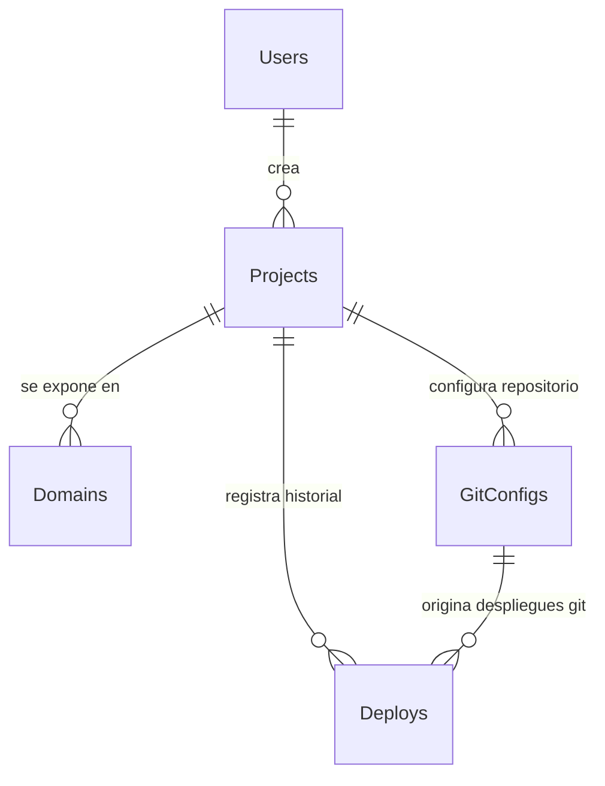

# SkyManifest ☁️

> **Your private cloud, manifested.**

## 1. Idea General del Proyecto

**SkyManifest** es una plataforma de infraestructura autohospedada (*Self-Hosted*) diseñada para democratizar el despliegue de sitios web estáticos. El proyecto permite a cualquier desarrollador construir su propia "nube privada", ofreciendo una alternativa a servicios comerciales como Vercel o Netlify.

Los usuarios pueden desplegar sus aplicaciones web simplemente arrastrando un archivo `.zip` o vinculando un repositorio de Git. El núcleo del sistema orquesta la recepción del código, su sanitización y la configuración automática de servidores web seguros, todo bajo el control total del administrador de la instancia.

## 2. Explicación del Nombre

El nombre **SkyManifest** encapsula la visión de infraestructura y control del proyecto:

* **Sky (Cielo / Nube):** Representa la libertad de crear tu propia infraestructura en la nube sin depender de servicios de terceros. El "Sky" simboliza un espacio ilimitado y privado donde el usuario tiene control total sobre sus aplicaciones, creando su propio ecosistema digital independiente.
* **Manifest (Manifiesto):** Es la declaración y registro detallado de cada aplicación desplegada. Cada despliegue crea un "manifiesto" que documenta el estado, configuración y existencia de la aplicación en la infraestructura.

## 3. Explicación Detallada y Flujo Híbrido

SkyManifest implementa un **sistema híbrido** que permite despliegues tanto desde archivos ZIP como desde repositorios Git, ofreciendo flexibilidad máxima a los desarrolladores. La arquitectura mantiene un enfoque **API-First** donde Laravel actúa como motor independiente exponiendo una API RESTful.

### El flujo de vida de un despliegue híbrido:

1. **Input Híbrido:** El usuario puede elegir entre:
   - **Carga ZIP:** Arrastra archivos directamente al dashboard
   - **Conexión Git:** Vincula un repositorio con configuración de rama y directorio base

2. **Procesamiento Inteligente:** El `DeploymentService` detecta el tipo de fuente y aplica la estrategia correspondiente:
   - **ZIP:** Descompresión y sanitización inmediata
   - **Git:** Clonado, checkout de rama específica y procesamiento del directorio base

3. **Construcción Normalizada:** Independientemente del origen, ambos flujos convergen en un proceso unificado de limpieza y preparación en volúmenes Docker compartidos.

4. **Enrutamiento Dinámico:** Caddy Web Server recibe instrucciones via API para configurar el routing y SSL automático.

5. **Despliegue Live:** Zero downtime deployment con monitoreo de estado y logs detallados.

## 4. Arquitectura de Software

El proyecto utiliza **Laravel** como framework base, implementando un patrón **MVC (Modelo-Vista-Controlador)** robustecido con capas de **Repository** y **Service** para una separación de responsabilidades limpia y escalable.

### A. Estructura de Directorios y Capas

El proyecto respeta la estructura moderna de Laravel, añadiendo capas específicas de dominio:

* **📂 app/Http/Controllers:**
* Puntos de entrada ligeros. Solo validan la petición HTTP y devuelven respuestas JSON estandarizadas. No contienen lógica de negocio.

* **📂 app/Services:**
* El cerebro de la aplicación.
* **DeploymentService:** Maneja la lógica de archivos, descompresión, Git y limpieza.
* **CaddyService:** Abstrae la complejidad de la API de Caddy, construyendo los JSON de configuración necesarios.

* **📂 app/Repositories:**
* Capa de acceso a datos. Aísla las consultas de Eloquent, permitiendo que los servicios pidan datos ("Dame los últimos 5 deploys") sin saber cómo se obtienen.

* **📂 app/Jobs:**
* Manejo de colas (Queues). Tareas pesadas como "Clonar Repo" o "Descomprimir Zip" se envían aquí para no bloquear la interfaz del usuario.

* **📂 database/migrations:**
* Control de versiones del esquema de base de datos.

* **📂 resources/views:**
* Contiene el "App Shell", la vista principal que carga la aplicación SPA/Dashboard.

### B. Definición de Rutas

* **Ubicación:** `routes/api.php`
* **Estrategia:** Todas las interacciones de datos ocurren aquí. Se definen endpoints RESTful agrupados, protegidos por middleware (Sanctum) y con límites de peticiones (Rate Limiting) para proteger la infraestructura.

## 5. Modelos de Datos (Entidades)

A continuación se detalla la estructura de la base de datos relacional.

### Diagrama de Relaciones

### Arquitectura de Base de Datos Híbrida

La base de datos sigue la **3ra Forma Normal (3FN)** para eliminar redundancias y permitir despliegues híbridos. La separación de `git_configs` como entidad independiente permite que un proyecto pueda tener configuraciones Git opcionales, mientras mantiene compatibilidad con despliegues ZIP.

### Tablas y Estructuras

#### 1. Tabla: `users`

Representa al arquitecto o dueño de los proyectos en la nube privada.

| Campo | Tipo | Descripción |
| --- | --- | --- |
| `id` | BIGINT (PK) | Identificador único. |
| `name` | STRING | Nombre completo. |
| `email` | STRING | Correo electrónico (Unique). |
| `password` | STRING | Contraseña encriptada. |
| `created_at` | TIMESTAMP | Fecha de registro. |

#### 2. Tabla: `projects`

La unidad lógica que agrupa los despliegues de una aplicación específica.

| Campo | Tipo | Descripción |
| --- | --- | --- |
| `id` | BIGINT (PK) | Identificador único. |
| `user_id` | BIGINT (FK) | Relación con la tabla `users`. |
| `name` | STRING | Nombre del proyecto (ej: "Landing Page V1"). |
| `description` | TEXT | Descripción opcional (Null). |
| `created_at` | TIMESTAMP | Fecha de creación. |

#### 3. Tabla: `deploys`

El registro inmutable de cada versión subida a la nube, con soporte híbrido para Git y ZIP.

| Campo | Tipo | Descripción |
| --- | --- | --- |
| `id` | BIGINT (PK) | Identificador único. |
| `project_id` | BIGINT (FK) | Relación con la tabla `projects`. |
| `git_config_id` | BIGINT (FK, nullable) | Relación con `git_configs` (solo para deploys Git). |
| `source_type` | ENUM | Tipo de origen: `git`, `zip`. |
| `commit_hash` | STRING (nullable) | Hash del commit (solo para deploys Git). |
| `status` | ENUM | Estado: `pending`, `processing`, `success`, `failed`. |
| `log_messages` | JSON | Bitácora de eventos del proceso (errores, éxito). |
| `path` | STRING | Ruta física del almacenamiento en el volumen Docker. |
| `duration_ms` | INTEGER | Tiempo de procesamiento en milisegundos. |
| `created_at` | TIMESTAMP | Fecha del despliegue. |

#### 4. Tabla: `git_configs`

Configuración Git asociada a proyectos para despliegues automáticos.

| Campo | Tipo | Descripción |
| --- | --- | --- |
| `id` | BIGINT (PK) | Identificador único. |
| `project_id` | BIGINT (FK) | Relación con la tabla `projects`. |
| `repository_url` | STRING | URL del repositorio Git (ej: `https://github.com/user/repo.git`). |
| `branch` | STRING | Rama a desplegar (default: `main`). |
| `base_directory` | STRING | Directorio base dentro del repo (default: `/`). |
| `created_at` | TIMESTAMP | Fecha de configuración. |

#### 5. Tabla: `domains`

La puerta de enlace pública para acceder a los proyectos.

| Campo | Tipo | Descripción |
| --- | --- | --- |
| `id` | BIGINT (PK) | Identificador único. |
| `project_id` | BIGINT (FK) | Relación con la tabla `projects`. |
| `url` | STRING | El dominio o subdominio asignado (ej: `app.skymanifest.cloud`). |
| `is_active` | BOOLEAN | Switch para activar/desactivar el tráfico. |
| `ssl_status` | STRING | Estado del certificado TLS (ej: `issued`). |
| `created_at` | TIMESTAMP | Fecha de vinculación. |
