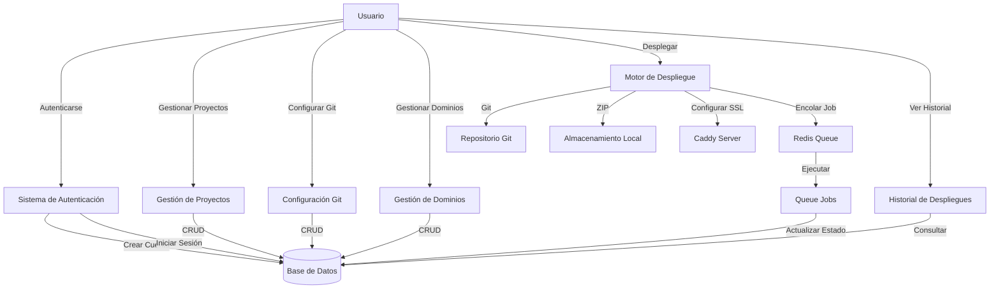
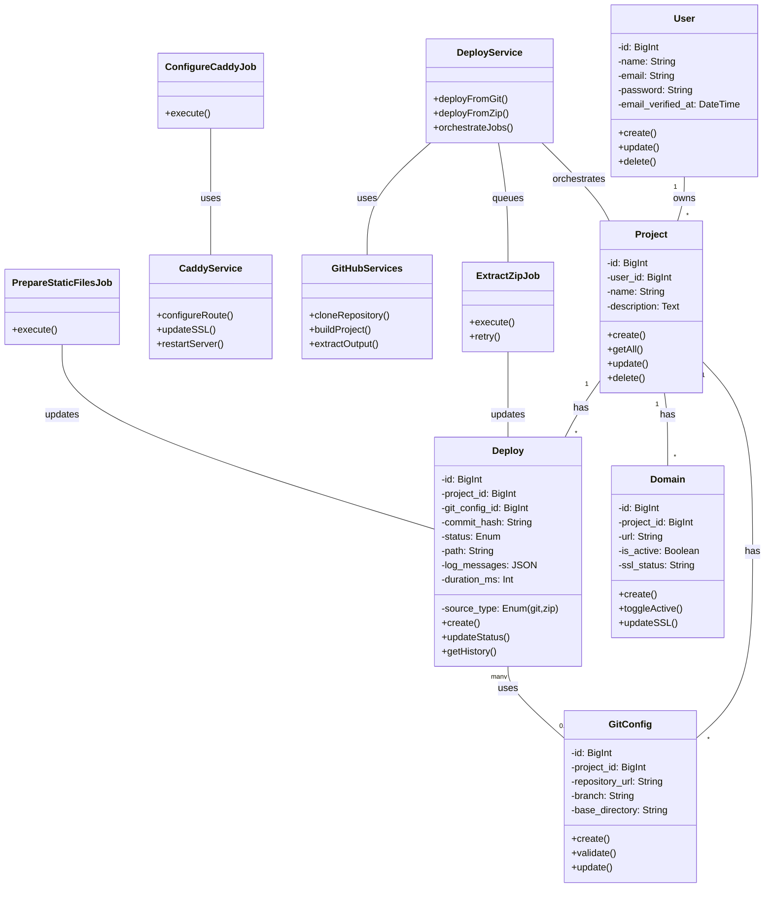
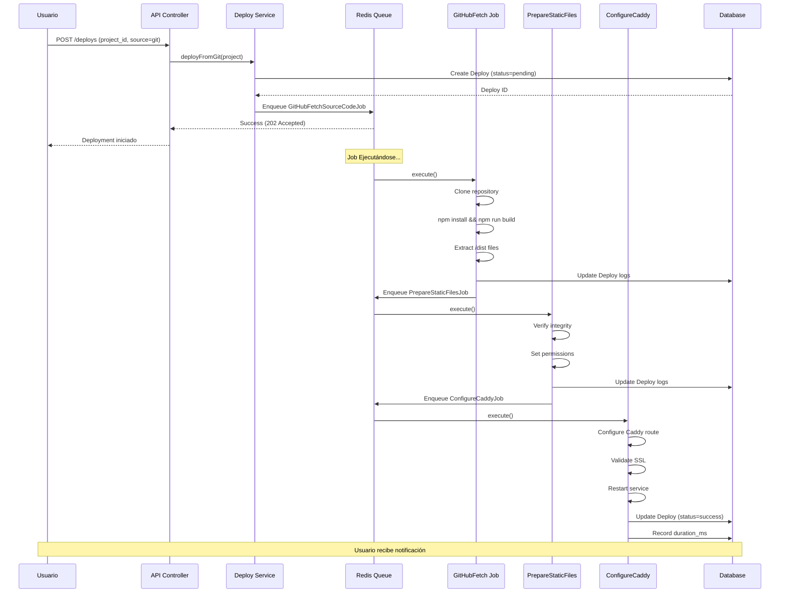
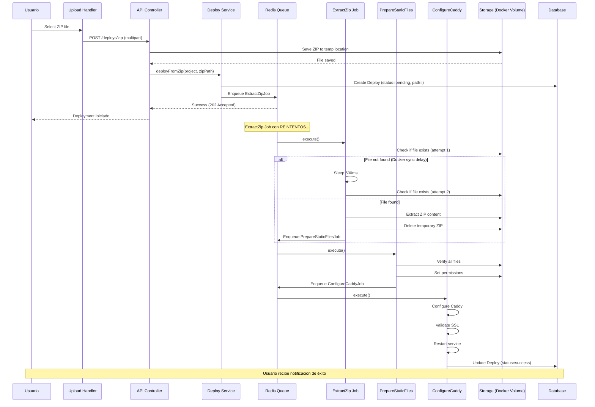

# SkyManifest - Requerimientos y Casos de Uso

**Versión:** 1.0  
**Fecha:** 19 de diciembre de 2025  
**Estado:** Prototipo  
**Nota:** Este es un prototipo desarrollado por una sola persona. Es posible que algunos de los requisitos no se cumplan al 100% debido a limitaciones de tiempo y scope.

---

## Introducción

**SkyManifest** es una plataforma web innovadora diseñada para simplificar significativamente el proceso de despliegue de sitios web estáticos. En un mundo donde la velocidad de desarrollo y la facilidad de deployment son críticos, SkyManifest abstrae la complejidad de la infraestructura tradicional, permitiendo a desarrolladores enfocarse en lo que realmente importa: el código.

Este documento especifica los requerimientos funcionales, no funcionales, casos de uso y la arquitectura técnica de la plataforma. Está dirigido a desarrolladores, arquitectos y stakeholders que participan en el proyecto.

---

## Tabla de Contenidos

1. [Introducción](#introducción)
2. [Descripción General del Proyecto](#descripción-general-del-proyecto)
3. [Requerimientos Funcionales](#requerimientos-funcionales)
4. [Requerimientos No Funcionales](#requerimientos-no-funcionales)
5. [Diagrama de Casos de Uso](#diagrama-de-casos-de-uso)
6. [Casos de Uso Detallados](#casos-de-uso-detallados)
7. [Diagrama de Clases UML](#diagrama-de-clases-uml)
8. [Diagrama de Secuencia - Despliegue Git](#diagrama-de-secuencia---despliegue-git)
9. [Diagrama de Secuencia - Despliegue ZIP](#diagrama-de-secuencia---despliegue-zip)
10. [Matriz RACI](#matriz-raci---responsabilidades)
11. [Estimación de Esfuerzo](#estimación-de-esfuerzo)
12. [Consideraciones Técnicas](#consideraciones-técnicas)
13. [Definición de Hecho](#definición-de-hecho-dod)

---

## Descripción General del Proyecto

**SkyManifest** es una plataforma web que simplifica el despliegue de sitios web estáticos, permitiendo a desarrolladores desplegar rápidamente proyectos desde repositorios Git o archivos ZIP, sin necesidad de gestionar infraestructura en la nube directamente.

### Objetivo Principal
Facilitar y agilizar el despliegue de sitios web estáticos mediante una interfaz centralizada que abstrae la complejidad de servidores web, SSL, gestión de dominios y almacenamiento.

---

## 2. Requerimientos Funcionales

### RF-001: Autenticación y Autorización
- El usuario debe poder registrarse con email y contraseña
- El usuario debe poder iniciar sesión
- El usuario debe poder cerrar sesión
- Solo usuarios autenticados pueden acceder a recursos privados
- Cada usuario solo puede gestionar sus propios proyectos y despliegues

### RF-002: Gestión de Proyectos
- El usuario puede crear nuevos proyectos asociando un nombre y descripción
- El usuario puede listar todos sus proyectos
- El usuario puede visualizar detalles de un proyecto específico
- El usuario puede actualizar nombre y descripción de un proyecto
- El usuario puede eliminar un proyecto (eliminando también sus dominios y despliegues asociados)

### RF-003: Configuración de Despliegue (Git)
- El usuario puede crear una configuración Git vinculando un repositorio (HTTPS/SSH URL)
- El usuario puede especificar la rama de despliegue (default: `main`)
- El usuario puede especificar el directorio de salida del build (ej: `/dist`, `/public_html`)
- **Importante:** El sistema espera que los archivos ya estén compilados en la carpeta `dist` (o la especificada) antes de iniciar el despliegue
- El usuario puede listar todas las configuraciones Git de un proyecto
- El usuario puede actualizar configuraciones Git existentes
- El usuario puede eliminar configuraciones Git

### RF-004: Despliegue desde Repositorio Git
- El usuario puede disparar un despliegue automático desde Git
- El sistema clona el repositorio en la rama especificada
- El sistema ejecuta comandos de build predefinidos (npm install, npm run build)
- El sistema extrae archivos del directorio especificado (asumiendo que ya están compilados en `dist`)
- El sistema prepara archivos estáticos para servir
- El sistema configura el servidor web (Caddy) con la nueva versión
- El usuario puede ver el progreso y logs del despliegue en tiempo real

### RF-005: Despliegue desde Archivo ZIP
- El usuario puede subir un archivo ZIP con los archivos estáticos
- El sistema valida que sea un ZIP válido
- El sistema extrae el contenido del ZIP
- El sistema maneja sincronización de archivos en Docker (con reintentos)
- El sistema prepara archivos para servir
- El sistema configura el servidor web con los nuevos archivos
- El usuario recibe confirmación de despliegue exitoso o error

### RF-006: Gestión de Dominios
- El usuario puede asociar un dominio a un proyecto
- El usuario puede configurar múltiples dominios para el mismo proyecto
- El usuario puede activar/desactivar dominios sin perder datos
- El usuario puede eliminar dominios
- El sistema gestiona SSL automáticamente para cada dominio
- El usuario puede ver el estado de SSL (pending, issued, failed)

### RF-007: Historial de Despliegues
- El usuario puede ver un registro completo de todos los despliegues
- El usuario puede filtrar despliegues por estado (pending, processing, success, failed)
- El usuario puede filtrar despliegues por fecha
- El usuario puede ver logs detallados de cada despliegue
- El usuario puede ver tiempo de duración de cada despliegue
- El usuario puede ver commit hash (despliegues Git)

### RF-008: Monitoreo y Alertas
- El sistema registra cada evento en el despliegue con timestamp
- El usuario recibe notificación de despliegue exitoso
- El usuario recibe notificación de despliegue fallido con motivo del error
- El sistema mantiene logs persistentes para auditoría

---

## 3. Requerimientos No Funcionales

### RNF-001: Rendimiento
- Despliegue de sitio estático debe completarse en menos de 5 minutos
- Respuesta a solicitudes de API debe ser menor a 500ms

### RNF-002: Disponibilidad
- El almacenamiento debe estar en volumen persistente Docker

### RNF-003: Seguridad
- Contraseñas deben estar encriptadas (bcrypt)
- Todas las conexiones deben usar HTTPS/SSL
- Tokens de autenticación deben expirar después de inactividad
- No se debe permitir acceso a directorios privados

### RNF-004: Escalabilidad
- Arquitectura basada en jobs en cola (Redis) para procesamiento asincrónico
- Soporte para múltiples usuarios simultáneamente
- Base de datos normalizada para eficiencia de consultas

### RNF-005: Mantenibilidad
- Código documentado con autodocumentación en PhpDoc
- Arquitectura en capas (Controllers, Services, Repositories)
- Separación de responsabilidades clara

---

## 5. Diagrama de Casos de Uso



---

## 6. Casos de Uso Detallados

### UC-001: Registrar Nuevo Usuario

**Actores:** Visitante

**Precondiciones:**
- El usuario no tiene cuenta en el sistema

**Flujo Principal:**
1. El usuario accede a la página de registro
2. El usuario ingresa email, nombre y contraseña
3. El sistema valida que el email sea único
4. El sistema valida que la contraseña cumpla criterios de seguridad
5. El sistema encripta la contraseña
6. El sistema crea el usuario en la base de datos
7. El sistema envía email de confirmación (opcional)
8. El usuario es redirigido a login

**Flujo Alternativo - Email Duplicado:**
6a. El sistema rechaza el registro
6b. El sistema muestra mensaje de error

---

### UC-002: Crear Proyecto Nuevo

**Actores:** Usuario Autenticado

**Precondiciones:**
- Usuario está autenticado

**Flujo Principal:**
1. El usuario navega a "Nuevo Proyecto"
2. El usuario ingresa nombre del proyecto (requerido)
3. El usuario ingresa descripción (opcional)
4. El usuario hace clic en "Crear"
5. El sistema valida que el nombre no esté vacío
6. El sistema crea el proyecto asociado al usuario
7. El sistema redirige a la página de detalles del proyecto
8. El usuario puede ahora configurar Git, agregar dominios, o subir ZIP

**Flujo Alternativo - Nombre Vacío:**
5a. El sistema rechaza el envío
5b. El usuario recibe mensaje de validación

---

### UC-003: Desplegar desde Repositorio Git

**Actores:** Usuario Autenticado

**Precondiciones:**
- Usuario está autenticado
- Proyecto existe
- Configuración Git está configurada
- Dominio está asociado al proyecto

**Flujo Principal:**
1. El usuario navega a la página de despliegue del proyecto
2. El usuario selecciona fuente "Git"
3. El usuario confirma despliegue desde rama especificada
4. El sistema crea registro Deploy con estado `pending`
5. El sistema encola JobGitHubFetchSourceCode
6. **GitHubFetchSourceCodeJob:**
   - Clona repositorio en rama especificada
   - Ejecuta npm install
   - Ejecuta npm run build
   - Extrae archivos del directorio /dist
   - Encola PrepareStaticFilesJob
7. **PrepareStaticFilesJob:**
   - Verifica integridad de archivos
   - Establece permisos correctos
   - Encola ConfigureCaddyJob
8. **ConfigureCaddyJob:**
   - Configura Caddy con nueva ruta
   - Valida SSL
   - Reinicia servicio si es necesario
   - Encola UpdateDeployStatusJob
9. **UpdateDeployStatusJob:**
   - Actualiza estado a `success`
   - Registra duración
   - Notifica al usuario

**Flujo Alternativo - Clonación Fallida:**
6a. Job captura error
6b. Estado se actualiza a `failed`
6c. Usuario recibe notificación de error

**Flujo Alternativo - Build Fallido:**
6c. Job captura error durante npm run build
6d. Estado se actualiza a `failed`
6e. Usuario recibe logs del error

---

### UC-004: Desplegar desde Archivo ZIP

**Actores:** Usuario Autenticado

**Precondiciones:**
- Usuario está autenticado
- Proyecto existe
- Archivo ZIP está preparado
- Dominio está asociado al proyecto

**Flujo Principal:**
1. El usuario navega a "Nuevo Despliegue"
2. El usuario selecciona fuente "ZIP"
3. El usuario selecciona archivo ZIP desde su computadora
4. El sistema valida que sea un archivo ZIP válido
5. El sistema sube el archivo a almacenamiento temporal
6. El sistema crea registro Deploy con estado `pending`
7. El sistema encola ExtractZipJob
8. **ExtractZipJob (con reintentos):**
   - Valida que archivo ZIP exista (reintenta si no sincronizó en Docker)
   - Extrae contenido a directorio del proyecto
   - Elimina ZIP temporal
   - Encola PrepareStaticFilesJob
9. **PrepareStaticFilesJob:**
   - Verifica integridad de archivos
   - Establece permisos
   - Encola ConfigureCaddyJob
10. **ConfigureCaddyJob:**
    - Configura Caddy
    - Valida SSL
    - Reinicia servicio
    - Encola UpdateDeployStatusJob
11. **UpdateDeployStatusJob:**
    - Estado `success`
    - Notifica usuario
    - Registra duración

**Flujo Alternativo - ZIP Inválido:**
4a. Sistema rechaza archivo
4b. Usuario recibe mensaje de error

**Flujo Alternativo - Sincronización Docker (RETRY):**
8a. Sistema no encuentra archivo (delay en Docker)
8b. Sistema reintenta con espera de 500ms
8c. Hasta 3 intentos máximo
8d. Si falla, estado → `failed`, notificar usuario

---

### UC-005: Agregar Dominio a Proyecto

**Actores:** Usuario Autenticado

**Precondiciones:**
- Usuario está autenticado
- Proyecto existe
- Dominio no está registrado en otro proyecto activo

**Flujo Principal:**
1. El usuario navega a "Dominios" del proyecto
2. El usuario ingresa nuevo dominio (ej: `app.skymanifest.local`)
3. El usuario hace clic en "Agregar Dominio"
4. El sistema valida que dominio sea único
5. El sistema valida formato de dominio
6. El sistema crea registro Domain con `is_active=true`
7. El sistema inicia gestión de SSL automáticamente
8. El usuario es notificado con estado de SSL (`pending`)
9. El usuario puede ver progreso de SSL en listado de dominios

**Flujo Alternativo - Dominio Duplicado:**
4a. Sistema rechaza
4b. Usuario recibe mensaje de error

---

### UC-006: Ver Historial de Despliegues

**Actores:** Usuario Autenticado

**Precondiciones:**
- Usuario está autenticado
- Proyecto tiene despliegues previos

**Flujo Principal:**
1. El usuario navega a "Historial" del proyecto
2. El sistema muestra lista de todos los despliegues
3. El usuario puede ver:
   - Fecha y hora de despliegue
   - Estado (pending/processing/success/failed)
   - Tipo de fuente (git/zip)
   - Commit hash (si es Git)
   - Duración en ms
4. El usuario puede hacer clic en un despliegue para ver logs detallados
5. Los logs muestran cronología completa de eventos

**Filtros Disponibles:**
- Por estado (dropdown)
- Por fecha (rango)
- Por tipo de fuente

---

## 7. Diagrama de Clases UML



---

## 8. Diagrama de Secuencia - Despliegue Git



---

## 9. Diagrama de Secuencia - Despliegue ZIP



---

## 9. Matriz RACI - Responsabilidades

| Actividad | Usuario | Sistema | Base Datos | Queue |
|---|---|---|---|---|
| Crear Proyecto | Responsable | Soporta | Almacena | N/A |
| Configurar Git | Responsable | Valida | Almacena | N/A |
| Disparar Despliegue | Responsable | Orquesta | Registra | Procesa |
| Clonar Git | N/A | Ejecuta | N/A | Encola |
| Extraer ZIP | N/A | Ejecuta | N/A | Encola |
| Configurar Caddy | N/A | Ejecuta | N/A | Encola |
| Notificar Usuario | N/A | Informa | N/A | Registra |
| Auditoría/Logs | Consulta | Registra | Almacena | Registra |

---

## 10. Estimación de Esfuerzo

| Componente | Horas | Prioridad |
|---|---|---|
| Autenticación | 16 | ALTA |
| CRUD Proyectos | 12 | ALTA |
| Despliegue Git | 32 | ALTA |
| Despliegue ZIP | 24 | ALTA |
| Gestión Dominios | 20 | ALTA |
| Gestión SSL (Caddy) | 24 | ALTA |
| Historial/Logs | 16 | MEDIA |
| Notificaciones | 12 | MEDIA |
| Tests | 40 | ALTA |
| Documentación | 16 | MEDIA |
| **TOTAL** | **212 horas** | - |

---

## 11. Consideraciones Técnicas

### Retry Logic para Docker Sync
```
ExtractZipJob Workflow:
├── Attempt 1: Storage::exists(zipPath)
│   └── Si falla → Sleep 500ms
├── Attempt 2: Storage::exists(zipPath)
│   └── Si falla → Sleep 500ms
├── Attempt 3: Storage::exists(zipPath)
│   └── Si falla → Throw JobFailedException
└── Success → Extract and cleanup
```

### Job Chaining
Los despliegues utilizan `Bus::chain()` para garantizar ejecución secuencial:
```
Bus::chain([
    new GitHubFetchSourceCodeJob($deploy),
    new PrepareStaticFilesJob($deploy),
    new ConfigureCaddyJob($deploy),
])
->dispatch();
```

### Estados de Deploy
- `pending`: Creado, esperando procesamiento
- `processing`: Job en ejecución
- `success`: Completado exitosamente, sitio en línea
- `failed`: Error durante proceso

---

## 12. Definición de Hecho (DoD)

Una funcionalidad se considera completa cuando:

✅ Todos los tests unitarios pasan (>80% cobertura)  
✅ Todos los tests de integración pasan  
✅ Code review aprobado  
✅ PHPDoc comentarios completos en español  
✅ Sin warnings de linters (PHP, JavaScript)  
✅ Documentación actualizada en README.md  
✅ Casos de uso documentados  
✅ Manual testeado en ambiente local Docker  
✅ Sin quebrantos en despliegues previos  

---

**Documento generado:** 19 de diciembre de 2025  
**Siguiente revisión:** Diciembre 2025 post-desarrollo
